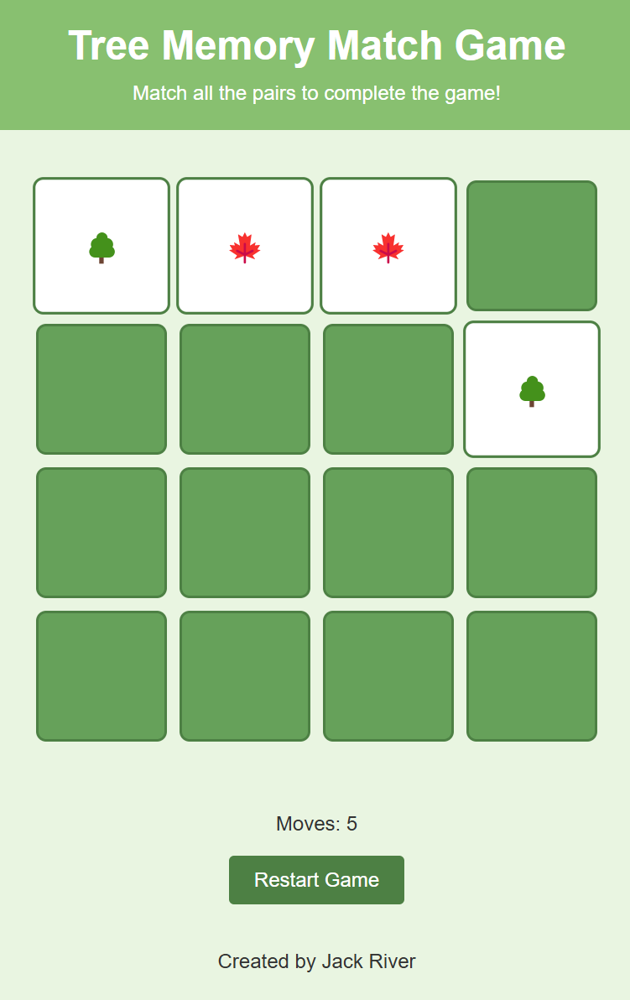

# Tree Memory Match Game

**Tree Memory Match Game** is a fun and interactive browser-based game where players match pairs of tree-themed cards. It's an engaging way to test your memory while enjoying a nature-inspired design.

🎮 **Play it now**: [Tree Memory Match Game](https://bip-river.github.io/tree-memory-match-game/)
---

## Features

- **Interactive Gameplay**: Match pairs of cards to win.
- **Dynamic Scoring**: Track your moves as you play.
- **Three Difficulty Levels**: Choose from Easy, Medium, or Hard.
- **Responsive Design**: Looks great on any screen size.
- **Tree Theme**: Cards feature delightful tree symbols like 🌲 and 🌳.

---

## How to Play

1. Select a difficulty level from the dropdown.
2. Click on a card to reveal its symbol.
3. Click on another card to find its match.
4. Match all pairs to complete the game.
5. Restart at any time with the "Restart Game" button.

---

## Development Setup

To run the game locally, follow these steps:

1. Clone the repository:
    ```bash
    git clone https://github.com/bip-river/tree-memory-match-game.git
    ```
2. Navigate to the project folder:
    ```bash
    cd tree-memory-match-game
    ```
3. Open `index.html` in your favorite browser.

---

## Manual Test Checklist (Mobile)

- Load the page on a ~375px-wide viewport and confirm the full grid is visible without horizontal scrolling.
- Tap the first card and confirm the timer starts only after the first flip.
- Flip and match a pair, then restart the game and verify the timer resets and stays idle until the next flip.
- Tap cards quickly to ensure no text selection or double-tap zoom occurs.

---

## Code Highlights

Here’s an example of the code that shuffles the card symbols:

```javascript
export function shuffle(array) {
    for (let i = array.length - 1; i > 0; i--) {
        const j = Math.floor(Math.random() * (i + 1));
        [array[i], array[j]] = [array[j], array[i]];
    }
    return array;
}
```

---

## Screenshot



---

## Contributing

Contributions are welcome! Feel free to fork the repository and submit a pull request with your improvements or suggestions.

---

## About the Author

Created by *Jack River*, a passionate forester who loves combining technology with nature.

---

## License

This project is licensed under the MIT License. See the [LICENSE](./LICENSE) file for details.
